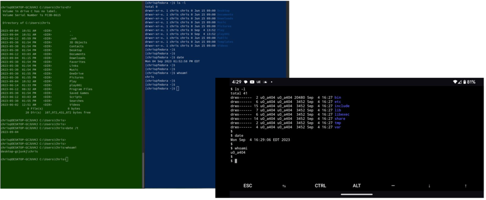
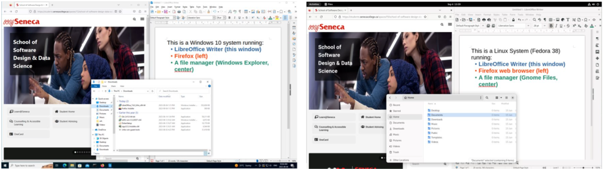

# Components of an Operating System 

Most modern operating systems are delivered as five separate and
inter-related parts:

## The Kernel 

This is the heart of the operating system, the main program (or group of programs) that controls the computer. The kernel operates in a special privileged mode (such as "Ring 0" on Intel/AMD x86 processors, or "Exception Level 3" on ARM processors), which allows it to manage the resources and security settings for all other software. The kernel is loaded by the computer's firmware (built-in software) and sets up the computer's hardware and resources before starting the services and user interface(s) in non-privileged mode, controlling the computer's hardware to enforce the privilege level.

(You will occasionally see alternate spellings of *kernel*, such as "kernal", in some operating systems - especially older ones. ).

## System Libraries 

Many programs need to perform the same operations, such as accessing the network, playing sound, or drawing something on the screen. Libraries provide a common set of software procedures (also known as functions, methods, routines, or subroutines) which programs access to perform these common operations. This eliminates the need for each program to contain duplicate code for these common operations, which reduces software duplication and program size. Although additional libraries may be installed on the computer, the system libraries provided as part of the operating system provide the most broadly-used procedures required by nearly every program. 

## Services

These are programs that run continuously in the background, providing services such as WiFi authentication, print management, and file sharing. Unlike the kernel, these programs don't operate with full system privilege, and are therefore subject to the same type of resource and security management as regular programs, and they also utilize the system libraries.

## The User Interface(s) 

This is the software that enables the user to interact with the system.
Most operating systems provide at least two user interfaces:

1\. A text-based user interface that enables the user to enter commands,
view the output from those commands, and interact with full-screen text
interfaces such as file editors and file managers. This may be referred
to as a text user interface (TUI) or a command line interface (CLI).
Here are command line interfaces on Windows, Linux, and Android systems
displaying similar information:

2\. A graphical user interface (GUI) that typically enables the user to
interact with multiple application windows, using a keyboard and a
pointing device such as a mouse, trackpad, or touchscreen. Here are
graphical user interfaces on Windows and Linux systems showing similar
capabilities and information:

## Utilities and Applications 

Most operating systems provide a set of tools to enable users to perform
setup, configuration, and maintenance tasks. For example, they may
provide "utility" software to add/remove software, configure hardware,
and manage files. This utility software may take the form of commands
that are accessed through a CLI, or graphical utilities that are
accessed through a GUI. Most operating systems also provide a set of
basic starter applications, such as a text editor, clock, a few games,
and sometimes a web browser; the quantity and complexity of the included
applications vary considerably from one operating system to another.

